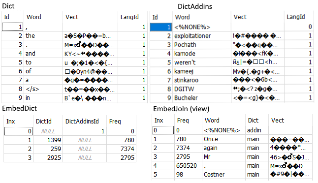

# Axaprj.WordToVecDB
DB access layer of embedded vectors processing tools. 
A part of [FastTextProcess](https://github.com/Axaprj/FastTextProcess) project.
 
## contents
Entity-style support of the following databases:
 - word2vect - extendable the word to vector dictionary
 - vect_result - word to vector processing result database

## word2vect 
Word to vector dictionary SQLite DB

## vect_result
Custom text word to vector processing result SQLite DB

## code
VS 2017, VS 2019, .NET Core, SQLite

## authors
[Axaprj](https://github.com/Axaprj), [Igor Alexeev](mailto:axaprj2000@yahoo.com) 

You are welcome to [Property Indicators Lab](https://propertyindicators.github.io/)! 
We know how to use it in real projects.
For any questions, please contact us at email propertyindicators@gmail.com.
